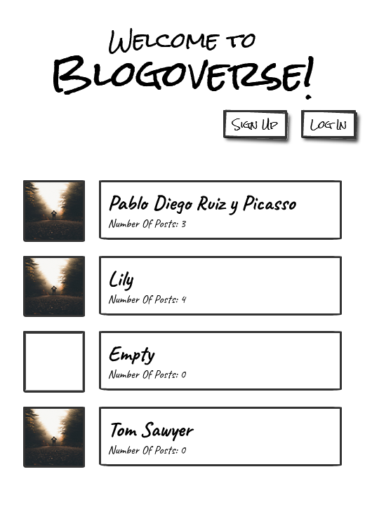
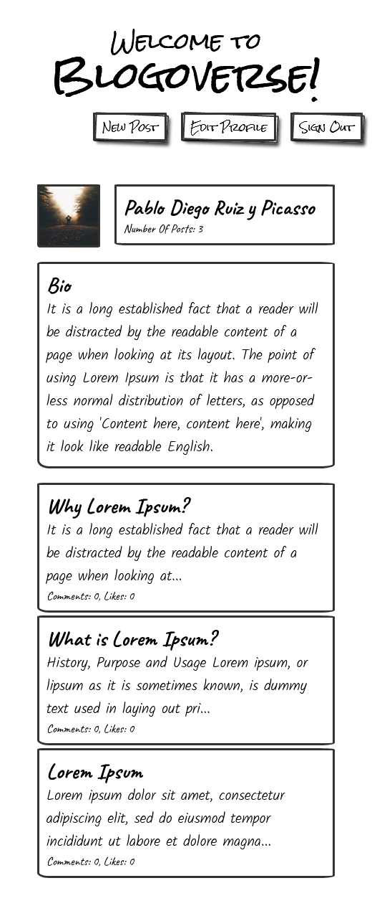
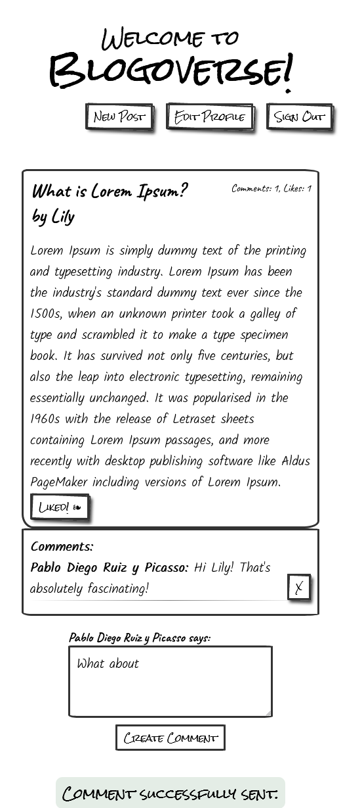

# BlogoVerse

> A Blogoverse for dedicated bloggers to blog in peace. Made with Ruby on Rails.

 |   |   |   |
 | - |:-:| -:|
 | |  |  |

## Built With

- Ruby
- Rails
- Rubocop
- Devise
- Rspec
- Capybara

## Getting Started

To get a local copy up and running follow these simple example steps.

### Prerequisites
- Ruby
- PostgreSQL
- RubyGems
- Node.js
- Yarn
- Rails
### Setup
- Clone the repository using `git clone https://github.com/qwibbler/blogoverse`.
- `cd` into the project folder.
- Update your database credentials in the `\config\database.yml`.

### Install
- Run `bundle install` in your terminal to install all the required dependencies.
- Run `rails db:setup` to configure your database.
- Run `rails s` to start the server.
- Go to `localhost:3000` (or whatever port the server is listening on).

### Usage
- You can sign up with new user, or log in if you already have an account.
- You can also edit your profile data to add your personal information or a profile picture.
- You can blog to your heart's content with this website.
- You can view all the users and their posts, as well like and comment on them.
- You can view the backend API at `localhost:3000/api_docs`.
### Run tests
- Run `rspec` in your terminal.
<!-- ### Deployment -->

## Authors

👤 **Humaira Zaman**

- GitHub: [@qwibbler](https://github.com/qwibbler)
- Twitter: [@hmemaz](https://twitter.com/hmemaz)
- LinkedIn: [Humaira Zaman](https://www.linkedin.com/in/hmemaz1994/)

## 🤝 Contributing

Contributions, issues, and feature requests are welcome!

Feel free to check the [issues page](../../issues/).

## Show your support

Give a ⭐️ if you like this project!

## Acknowledgments

- Thank you to [Leonardo Goss](https://github.com/leopiresgoss) for his contribution and unstinting support and encouragement.
- And thank you to everyone on the internet for publishing numerous guides and solutions that made this project possible.

## 📝 License

This project is [MIT](./MIT.md) licensed.
